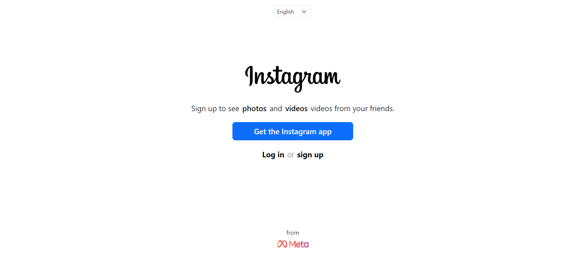
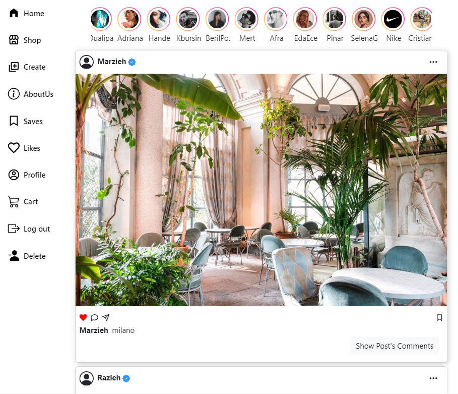
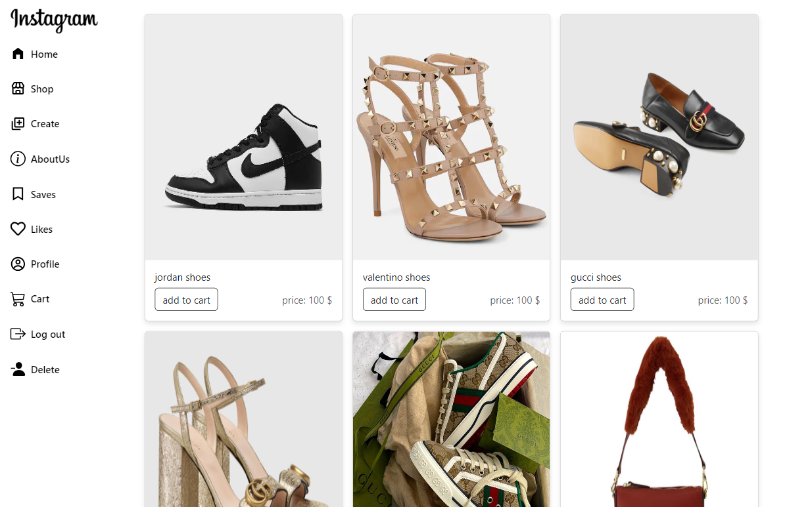
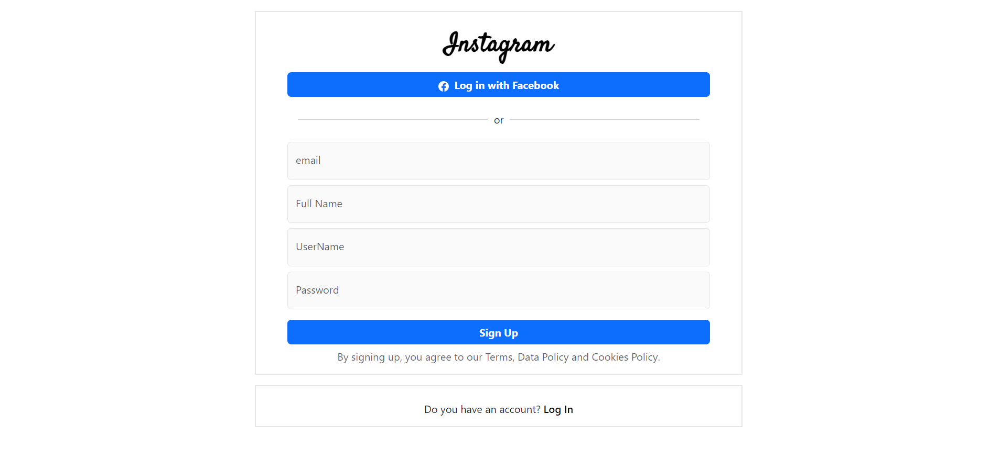
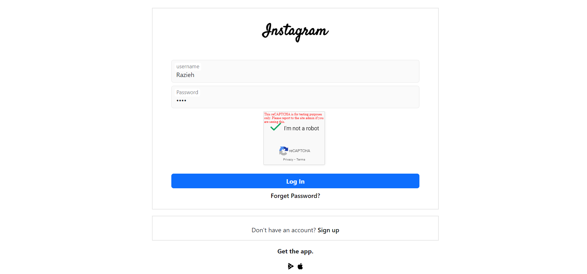
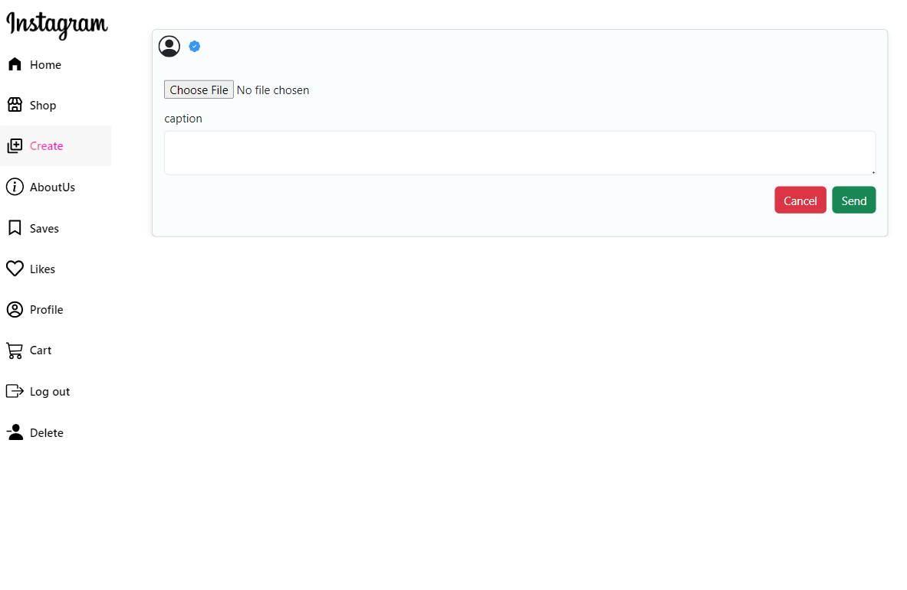

# instagram-clone

This is a REACTJS project bootstrapped with vite.
This project is a simulation of the famous INSTAGRAM website.

<!-- > Live demo [https://jsonserver-instagram-clone.iran.liara.run](https://instagram-clone.iran.liara.run)  -->
Please turn on your vpn first, then click on the link below
> Live demo [demo](https://instagram-clone-gamma-seven.vercel.app/)

<!-- Live demo [Instagram-clone](https://instagram-clone-laydgm5gs-marziehs-projects.vercel.app) -->
## Technologies Used

 
 
 
 
 
 
 
 
  
- react-redux
- redux-toolkit
- axios

## Packages Used

- formik
- yup
- json-server
- react-dom
- react-google-recaptcha
- react-icons
- react-lazy-load-image-component
- sweetalert
- redux-devtools
- react-fast-marquee

## Features

You can :

- log in
- sso
- log out
- sign up
- delete account
- add posts (You can add posts on the create page)
- delete posts
- like posts
- save posts
- Add a comment
- Delete a comment
- Product purchase(add to cart)
- View shopping cart
- Remove the product from the shopping cart
- View your profile information
- View about Instagram on the 'About Me' page

## Screenshots

<!-- If you have screenshots you'd like to share, include them here. -->

## Usage

1. git clone https://github.com/marziyemonshizadeh/instagram-clone.git
2. npm i
3. npx json-server --watch mydb.json --port 3001
4. npm run dev

## Project Status

Project is: \_finished

## Contact

Created by Marzieh Monshizadeh :)
